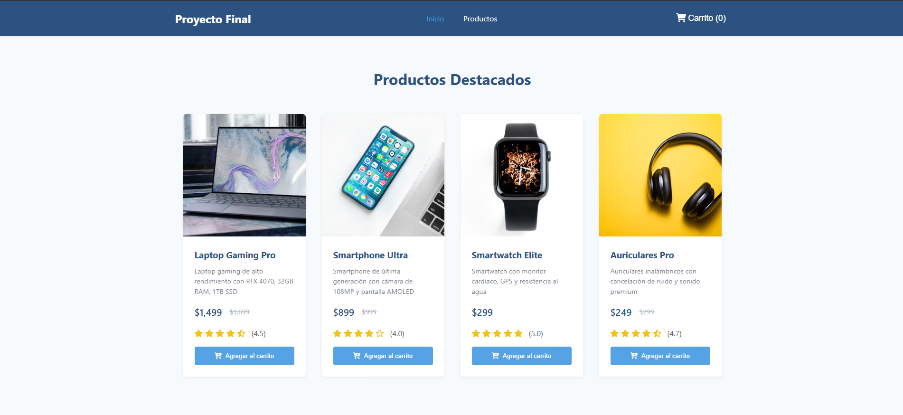
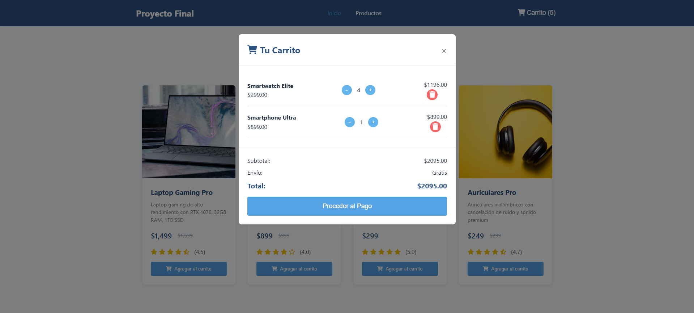

# Desarrollo Web 2 - Proyecto E-commerce

Es un E-commerce desarrollado en HTML, CSS y JavaScript puro. Incluye un sistema de carrito de compras con diferentes funciones; cantidad ajustable, eliminación de productos y cálculo automático del total.

---

## Características

- Visualización de productos.
- Agregado de productos al carrito.
- Incremento y decremento de cantidades.
- Eliminación individual de productos.
- Modal para mostrar el carrito de compras.
- Cálculo automático del total a pagar.
- Contador actualizado en el botón del carrito.
---

## Tecnologías utilizadas

- HTML5
- CSS3
- JavaScript

---

## Capturas de pantalla

### Página principal

### Carrito abierto

